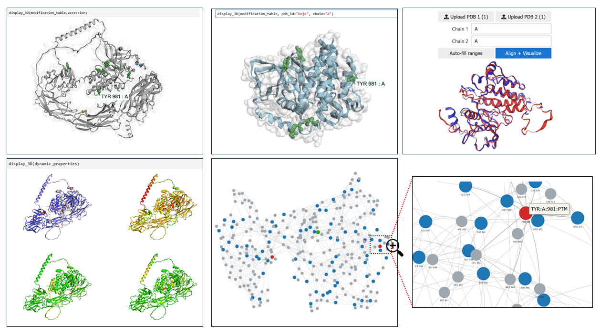
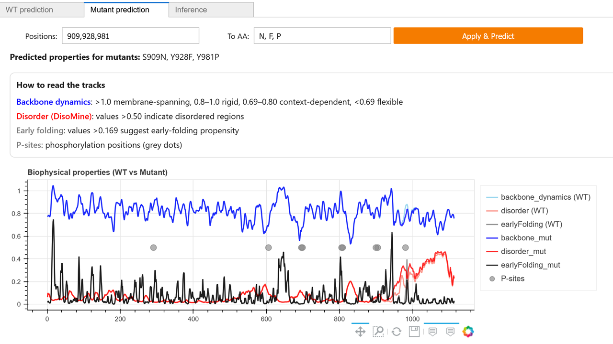
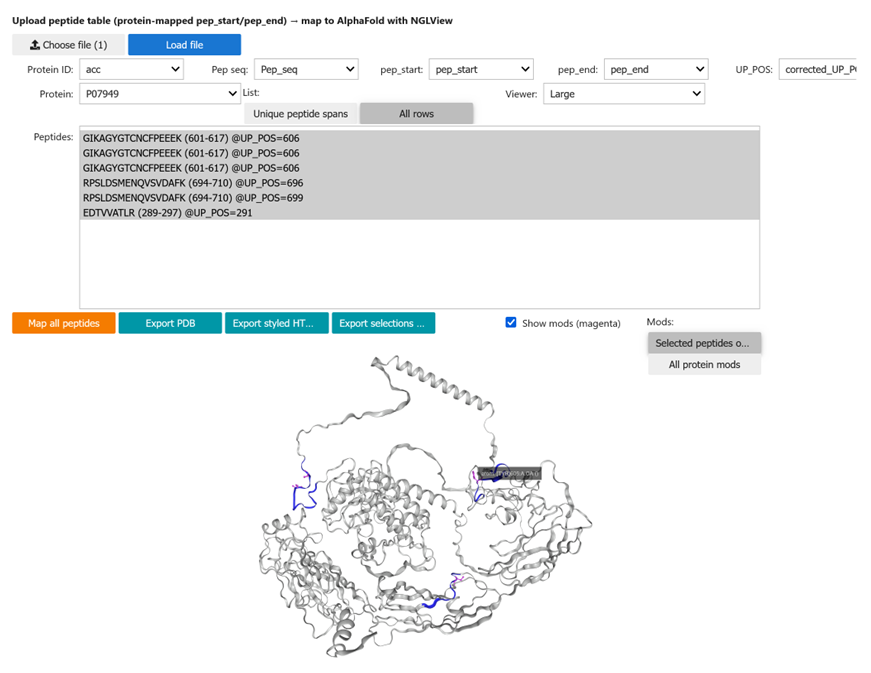

# Scop3P-notebooks
Jupyter Notebook examples of Scop3P REST API services.

## About Scop3P[^1]

**Scop3P: A Comprehensive Resource of Human Phosphosites within Their Full Context**

Protein phosphorylation is a key post-translational modification in many biological processes and is associated to human diseases such as cancer and metabolic disorders. The accurate identification, annotation, and functional analysis of phosphosites are therefore crucial to understand their various roles. Phosphosites are mainly analyzed through phosphoproteomics, which has led to increasing amounts of publicly available phosphoproteomics data. Several resources have been built around the resulting phosphosite information, but these are usually restricted to the protein sequence and basic site metadata. What is often missing from these resources, however, is context, including protein structure mapping, experimental provenance information, and biophysical predictions. We therefore developed Scop3P: a comprehensive database of human phosphosites within their full context. Scop3P integrates sequences (UniProtKB/Swiss-Prot), structures (PDB), and uniformly reprocessed phosphoproteomics data (PRIDE) to annotate all known human phosphosites. Furthermore, these sites are put into biophysical context by annotating each phosphoprotein with per-residue structural propensity, solvent accessibility, disordered probability, and early folding information. Scop3P, available at https://iomics.ugent.be/scop3p, presents a unique resource for visualization and analysis of phosphosites and for understanding of phosphosite structure–function relationships.

[^1]: Scop3P: A Comprehensive Resource of Human Phosphosites within Their Full Context, Pathmanaban Ramasamy, Demet Turan, Natalia Tichshenko, Niels Hulstaert, Elien Vandermarliere, Wim Vranken, and Lennart Martens
Journal of Proteome Research 2020 19 (8), 3478-3486. [DOI: 10.1021/acs.jproteome.0c00306](10.1021/acs.jproteome.0c00306).

**HTTP REST API**

Open the **Scop3P API** using the Swagger UI click [here](https://iomics.ugent.be/scop3p/swagger-ui/index.html)

## Jupyter Notebook index

This section contains the links to our online Jupyter Notebooks. We would like to invite you to contribute to our repository if you want to share your Jupyter Notebooks related to Scop3P. Please contact us at [pathmanaban.ramasamy@ugent.be](mailto:pathmanaban.ramasamy@ugent.be).

### Modifications endpoint (GET `scop3p/api/modifications`)

This notebook fetches PTMs and metadata for a given UniProt ID from Scop3P modification endpoint and visualizes them using simple plots.

Click on the next link to open the Jupyter Notebook in an executable environment:

### Structural and biophysical visualization framework

This notebook enables interactive visualization of PTMs and disease variants by integrating Scop3P and UniProt data with 3D structural mapping onto PDB and AlphaFold models. It supports biophysical property prediction, residue interaction network (RIN) analysis, and structural alignment to explore PTM-driven structural and functional effects.

#### Integrated structural and biophysical visualization of PTMs and disease variants

  

Click on the next link to open the Jupyter Notebook in an executable environment:

### Biophysical prediction and mutation effects

This notebook predicts sequence-based biophysical properties of proteins from a UniProt ID and visualizes them using interactive plots. Users can introduce one or multiple amino-acid mutations, re-compute the predictions on the mutated sequence, and directly compare wild-type and mutant profiles. A final inference step summarizes the impact of mutations based on changes in predicted biophysical properties.Simple notebook fetching modifications for UniProt ID [O00571](https://www.uniprot.org/uniprotkb/O00571/entry) (O00571 · DDX3X_HUMAN), predicting the biophysical properties and visualizing the results using different strategies.

#### Predicted biophysical profiles of wild-type and mutant protein sequences, highlighting phosphorylation sites along the 1D amino-acid coordinate

  

Click on the next link to open the Jupyter Notebook in an executable environment:

### Peptide-to-structure mapping

Interactive mapping of phosphopeptides—either fetched from Scop3P or uploaded by the user onto AlphaFold structures to visualize peptide coverage and modification sites.

#### Mapping phosphopeptides onto protein structures

  

Click on the next link to open the Jupyter Notebook in an executable environment:

| Scop3P peptides | Upload your own peptides |
|-----------------|--------------------------|
|  |  |

## About

The repository was created by the [Bio2Byte research group](https://bio2byte.be) at Vrije Universiteit Brussel and is maintained in collaboration with [Compomics](https://www.compomics.com) at the VIB-UGent Center for Medical Biotechnology.

- [Compomics](https://www.compomics.com): Computational Omics and Systems Biology Group
- [IBsquare](https://ibsquare.be): The Interuniversity Institute of Bioinformatics in Brussels
- [VIB](https://vib.be/en): Vlaams Instituut voor Biotechnologie
- [UGent](https://www.ugent.be): Universiteit Gent
- [VUB](https://vub.be): Vrije Universiteit Brussel
- [Elixir BE](https://www.elixir-belgium.org): Elixir Belgium

Made in Belgium :belgium:

