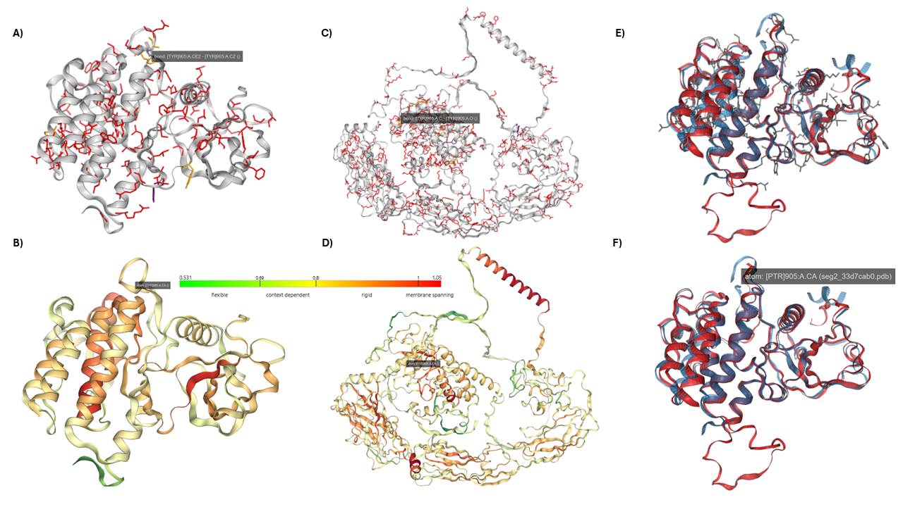
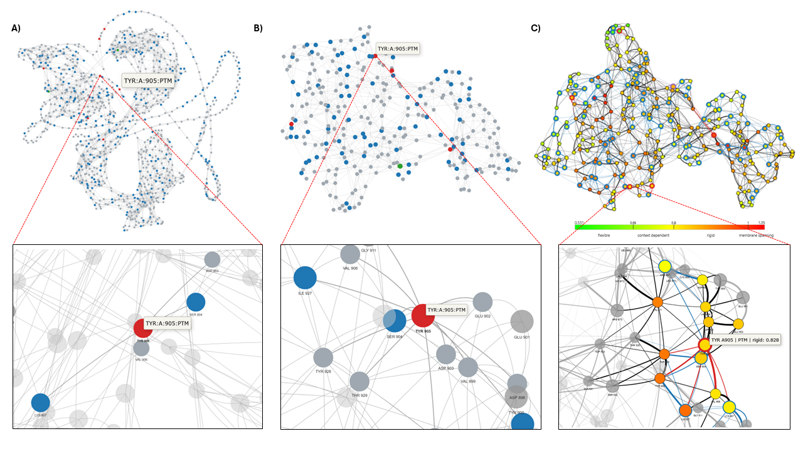
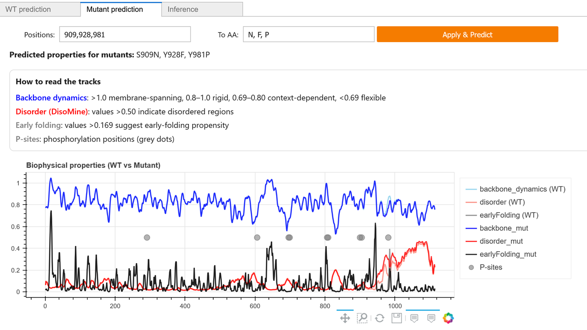
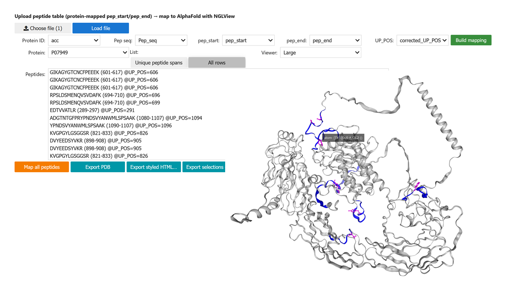
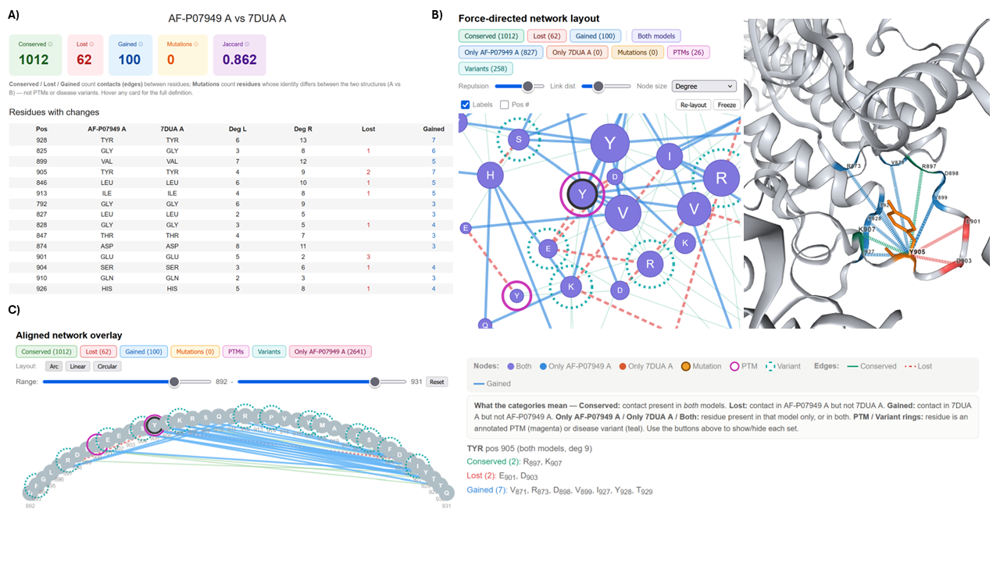
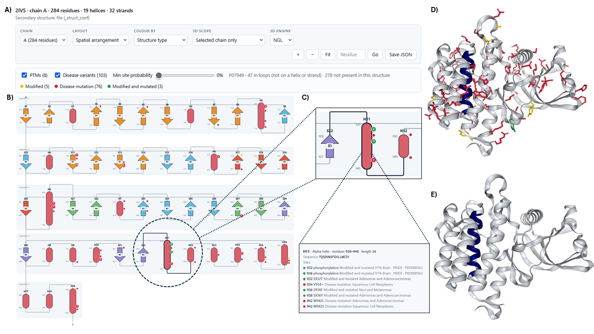

# Scop3P-notebooks
Jupyter Notebook examples of Scop3P REST API services as well as ShinyApp/Voilà applications for the Scop3P-Toolkit.


## Published container


This repository publishes the Galaxy-facing `bio2byte/scop3p-toolkit` container. The image packages the single-container portal exposed on port `8000` and is the intended entrypoint for a UseGalaxy interactive tool.

- Docker image: `bio2byte/scop3p-toolkit`
- Dockerfile target: `scop3p-toolkit`
- App-specific documentation: [`apps/README.md`](/Users/adrian/workspace/vub/Scop3P-notebooks/apps/README.md)

## Build and run the toolkit image

Build the published image locally:

```bash
DOCKER_DEFAULT_PLATFORM=linux/amd64 docker build \
  -f docker/Dockerfile \
  -t bio2byte/scop3p-toolkit:local \
  .
```

Run it locally:

```bash
docker run --rm -p 8000:8000 bio2byte/scop3p-toolkit:local
```

Then open `http://localhost:8000` to access the toolkit selector and launch the bundled interactive apps.

## Continuous delivery to Docker Hub

The GitHub Actions workflow lives in [`docker-publish.yml`](/Users/adrian/workspace/vub/Scop3P-notebooks/.github/workflows/docker-publish.yml) and has two stages:

1. `Pytest suite`
   Runs on pull requests, manual workflow dispatches, and version-tag pushes.
   It installs the Python dependencies from `requirements-biophysics.txt` and `requirements-shiny.txt`, then runs:

   ```bash
   pytest tests/unit tests/integration
   ```

2. `Build and publish Docker image`
   Runs only after the tests pass.

   - On pull requests and `workflow_dispatch` runs:
     - builds the `scop3p-toolkit` target for `linux/amd64`
     - validates that the Docker image can be built
     - does not publish anything to Docker Hub
   - On version tags matching `v*`:
     - builds the same image target
     - logs in to Docker Hub
     - publishes these tags:
       - `latest`
       - `sha-<short-commit>`
       - `<git-tag>` such as `v1.2.3`

The workflow resolves the Docker repository namespace in this order:

1. `DOCKERHUB_NAMESPACE` repository variable
2. `DOCKERHUB_USERNAME` repository secret
3. the lowercased GitHub repository owner as a fallback for build-only runs

Required repository secrets:

- `DOCKERHUB_USERNAME`
- `DOCKERHUB_TOKEN`

Optional repository variable:

- `DOCKERHUB_NAMESPACE`

If `DOCKERHUB_NAMESPACE` is not set, the workflow publishes to the same namespace as `DOCKERHUB_USERNAME`.

## About Scop3P[^1]

**Scop3P: A Comprehensive Resource of Human Phosphosites within Their Full Context**

Protein phosphorylation is a key post-translational modification in many biological processes and is associated to human diseases such as cancer and metabolic disorders. The accurate identification, annotation, and functional analysis of phosphosites are therefore crucial to understand their various roles. Phosphosites are mainly analyzed through phosphoproteomics, which has led to increasing amounts of publicly available phosphoproteomics data. Several resources have been built around the resulting phosphosite information, but these are usually restricted to the protein sequence and basic site metadata. What is often missing from these resources, however, is context, including protein structure mapping, experimental provenance information, and biophysical predictions. We therefore developed Scop3P: a comprehensive database of human phosphosites within their full context. Scop3P integrates sequences (UniProtKB/Swiss-Prot), structures (PDB), and uniformly reprocessed phosphoproteomics data (PRIDE) to annotate all known human phosphosites. Furthermore, these sites are put into biophysical context by annotating each phosphoprotein with per-residue structural propensity, solvent accessibility, disordered probability, and early folding information. Scop3P, available at https://iomics.ugent.be/scop3p, presents a unique resource for visualization and analysis of phosphosites and for understanding of phosphosite structure–function relationships.

[^1]: Scop3P: A Comprehensive Resource of Human Phosphosites within Their Full Context, Pathmanaban Ramasamy, Demet Turan, Natalia Tichshenko, Niels Hulstaert, Elien Vandermarliere, Wim Vranken, and Lennart Martens
Journal of Proteome Research 2020 19 (8), 3478-3486. [DOI: 10.1021/acs.jproteome.0c00306](10.1021/acs.jproteome.0c00306).

**HTTP REST API**

Open the **Scop3P API** using the Swagger UI click [here](https://iomics.ugent.be/scop3p/api/v1/docs)

## Jupyter Notebook index

This section contains the links to our online Jupyter Notebooks. We would like to invite you to contribute to our repository if you want to share your Jupyter Notebooks related to Scop3P, PTMs, Peptides or structural features. Please contact us at [pathmanaban.ramasamy@ugent.be](mailto:pathmanaban.ramasamy@ugent.be).

### Modifications endpoint (GET `scop3p/api/modifications`)

This notebook fetches PTMs and metadata for a given UniProt ID from Scop3P modification endpoint and visualizes them using simple plots.

<p align="center">

</p>

Click on the next link to open the Jupyter Notebook in an executable environment:

[](https://mybinder.org/v2/gh/Bio2Byte/Scop3P-notebooks/main?filepath=Scop3P_API.ipynb)

### Structure-guided analysis of PTMs and variants

This notebook enables interactive visualization of PTMs and disease variants by integrating Scop3P and UniProt data with 3D structural mapping onto PDB and AlphaFold models. It supports biophysical property prediction, residue interaction network (RIN) analysis, and structural alignment to explore PTM-driven structural and functional effects.

#### Integrated structural and biophysical visualization of PTMs and disease variants

<p align="center">
  
</p>

<p align="center">
  
</p>

Click on the next link to open the Jupyter Notebook in an executable environment:

| Notebook (JupyterLab) | Interactive app (Voilà) |
|----------------------|--------------------------|
| [](https://mybinder.org/v2/gh/Bio2Byte/Scop3P-notebooks/HEAD?filepath=notebooks/Scop3P_PTM_structure_viz_voila_app.ipynb) | [](https://mybinder.org/v2/gh/Bio2Byte/Scop3P-notebooks/HEAD?urlpath=voila/render/notebooks/Scop3P_PTM_structure_viz_voila_app.ipynb) |

 
> **Interactive app:** If there is any launch error then please open the *Notebook (JupyterLab)* link first to authenticate,  
> then launch the *Interactive app (Voilà)* by clicking the voila icon on top right corner.


### Biophysical prediction and mutation effect analysis

This notebook predicts sequence-based biophysical properties of proteins from a UniProt ID and visualizes them using interactive plots. Users can introduce one or multiple amino-acid mutations, re-compute the predictions on the mutated sequence, and directly compare wild-type and mutant profiles. A final inference step summarizes the impact of mutations based on changes in predicted biophysical properties.Simple notebook fetching modifications for UniProt ID [O00571](https://www.uniprot.org/uniprotkb/O00571/entry) (O00571 · DDX3X_HUMAN), predicting the biophysical properties and visualizing the results using different strategies.

#### Predicted biophysical profiles of wild-type and mutant protein sequences, highlighting phosphorylation sites along the 1D amino-acid coordinate

<p align="center">
  
</p>


Click on the next link to open the Jupyter Notebook in an executable environment:

| Notebook (JupyterLab) | Interactive app (Voilà) |
|----------------------|--------------------------|
| [](https://mybinder.org/v2/gh/Bio2Byte/Scop3P-notebooks/HEAD?filepath=notebooks/Scop3P_b2b_mutation_effect_voila_app.ipynb) | [](https://mybinder.org/v2/gh/Bio2Byte/Scop3P-notebooks/HEAD?urlpath=voila/render/notebooks/Scop3P_b2b_mutation_effect_voila_app.ipynb) |


### Structural localisation of mass spectrometry-derived peptides

Interactive mapping of phosphopeptides, either fetched from Scop3P or uploaded by the user onto AlphaFold structures to visualize peptide coverage and modification sites.

#### Mapping phosphopeptides onto protein structures

<p align="center">
  
</p>

Click on the next link to open the Jupyter Notebook in an executable environment:

| Workflow | Notebook (JupyterLab) | Interactive app (Voilà) |
|---------|------------------------|--------------------------|
| Scop3P peptides | [](https://mybinder.org/v2/gh/Bio2Byte/Scop3P-notebooks/HEAD?filepath=notebooks/Peptide_mapper_scop3p_voila.ipynb) | [](https://mybinder.org/v2/gh/Bio2Byte/Scop3P-notebooks/HEAD?urlpath=voila/render/notebooks/Peptide_mapper_scop3p_voila.ipynb) |
| Upload your own peptides | [](https://mybinder.org/v2/gh/Bio2Byte/Scop3P-notebooks/HEAD?filepath=notebooks/Peptide_mapper_fileupload_voila.ipynb) | [](https://mybinder.org/v2/gh/Bio2Byte/Scop3P-notebooks/HEAD?urlpath=voila/render/notebooks/Peptide_mapper_fileupload_voila.ipynb) |


### Residue interaction network analysis and alignment

This notebook generates residue interaction networks (RINs) from experimental structures, AlphaFold models, or user-supplied structures, with PTMs, variants, and biophysical properties mapped onto network nodes. It also compares RINs across structures or proteins to identify conserved, lost, and gained residue contacts and explore network rewiring associated with conformational changes or amino-acid substitutions.

#### Interactive residue interaction network analysis and comparison

<p align="center">
  
</p>

Click on the next link to open the Jupyter Notebook in an executable environment:

| Notebook (JupyterLab) | Interactive app (Voilà) |
|----------------------|--------------------------|
| [](https://mybinder.org/v2/gh/Bio2Byte/Scop3P-notebooks/HEAD?filepath=notebooks/RINAlign_align_and compare_networks.ipynb) | [](https://mybinder.org/v2/gh/Bio2Byte/Scop3P-notebooks/HEAD?urlpath=voila/render/notebooks/RINAlign_align_and compare_networks.ipynb) |

### Secondary-structure topology and interactive 3D visualization

This notebook generates two-dimensional secondary-structure topology diagrams from experimental structures or AlphaFold models, with PTMs and disease variants mapped directly onto the corresponding residues. Multiple topology layouts are supported, and the diagram is linked interactively to a 3D structure viewer, allowing topology elements and annotated sites to be explored across both representations.

#### Interactive secondary-structure topology linked to 3D protein structure

<p align="center">
  
</p>

Click on the next link to open the Jupyter Notebook in an executable environment:

| Notebook (JupyterLab) | Interactive app (Voilà) |
|----------------------|--------------------------|
| [](https://mybinder.org/v2/gh/Bio2Byte/Scop3P-notebooks/HEAD?filepath=notebooks/topology_viewer/topology_viewer.ipynb) | [](https://mybinder.org/v2/gh/Bio2Byte/Scop3P-notebooks/HEAD?urlpath=voila/render/notebooks//topology_viewer/topology_viewer.ipynb) |

## About

The repository was created by the [Bio2Byte research group](https://bio2byte.be) at Vrije Universiteit Brussel and is maintained in collaboration with [Compomics](https://www.compomics.com) at the VIB-UGent Center for Medical Biotechnology.

- [Compomics](https://www.compomics.com): Computational Omics and Systems Biology Group
- [IBsquare](https://ibsquare.be): The Interuniversity Institute of Bioinformatics in Brussels
- [VIB](https://vib.be/en): Vlaams Instituut voor Biotechnologie
- [UGent](https://www.ugent.be): Universiteit Gent
- [VUB](https://vub.be): Vrije Universiteit Brussel
- [Elixir BE](https://www.elixir-belgium.org): Elixir Belgium


<p align="center">
Made in Belgium :belgium:
</p>
